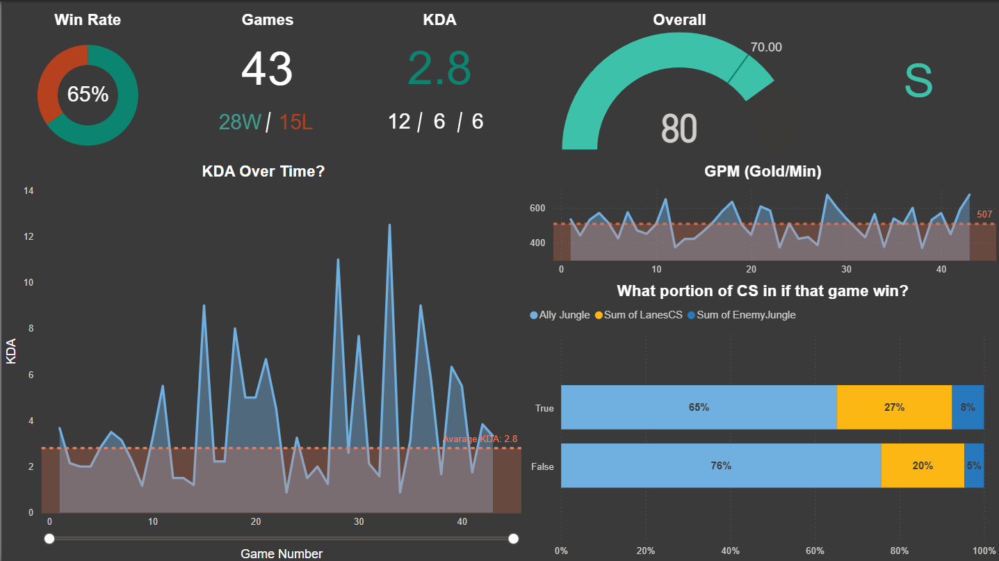
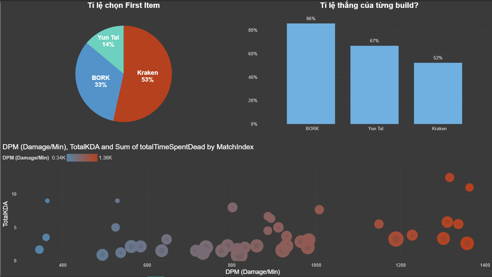

# 🎮 League of Legends Performance Analytics Dashboard

## 📌 Project Overview
This project focuses on analyzing personal match history data from **League of Legends** by leveraging the **Riot Games API**. The goal is to track performance metrics, identify trends in combat efficiency, and optimize gameplay strategies through interactive data visualization in **Power BI**.

---

## 📊 Dashboard Preview
*Check out the high-level insights from my recent 43 matches:*

### 1. Performance Summary & Economic Efficiency

*Tracking a **65% Win Rate** over 43 games, with detailed monitoring of **KDA (2.8)** and **Gold Per Minute (GPM)** trends.*

### 2. Strategic Build & Combat Analysis

*Visualizing the correlation between "First Item" choices and win probability, alongside Damage Per Minute (DPM) distribution.*

---

## 🎯 Key Questions Answered
* **Performance Tracking:** What are the current trends for KDA, win rates, and match grades (S/A/B)?
* **Economic Efficiency:** How does Gold Per Minute (GPM) correlate with match outcomes?
* **Build Optimization:** Which "First Item" build (e.g., Kraken, BORK) yields the highest win rate?
* **Combat Consistency:** What is the relationship between Damage Per Minute (DPM) and total KDA?

---

## 💡 Data Insights & Findings
* **Optimal Build Path:** Analysis identified that starting with **"Kraken Slayer"** (53% selection rate) resulted in an **86% win rate**, significantly outperforming other starts like BORK.
* **Economic Benchmarks:** Maintaining a **GPM > 420** and **DPM > 800** consistently leads to a performance grade of **'S'**.
* **Winning Formula:** Data suggests a strong correlation between securing a mid-game gold lead and a final Win Rate of 65%.

---

## 🛠️ Tools & Technologies
* **Power BI:** Used for data modeling, **DAX** measures, and interactive dashboard design.
* **Riot Games API:** Sourced match history and player statistics, handling nested **JSON structures**.
* **Python (Requests/Pandas):** Utilized for automated API data extraction and preprocessing.
* **Git & GitHub:** For version control and documentation management.

---

## 📂 Project Structure
* `/images`: Contains dashboard screenshots for the README.
* `LoL_Analysis.pbix`: The main Power BI project file.
* `data_extraction.py`: Python script for automated API data fetching.

---

## 📧 Contact
**Luu Nguyen Minh Quan**
* **LinkedIn:** [luuquan1105](https://www.linkedin.com/in/luuquan1105)
* **Email:** luuquan.work@gmail.com
